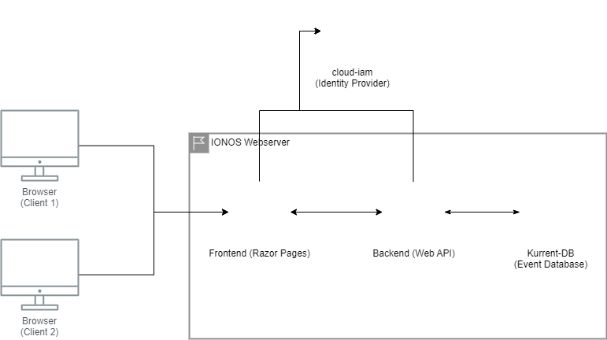

# Introduction
The “Raspo Stempelkarten” application enables the tracking and administration of member activities for our soccer club (Rasensport Uetersen 1926). With appropriate activity, the membership fee is reduced, thereby rewarding support.

# Business model
A fundamental element of the application is the team. A club can consist of any number of teams, with each team being an isolated administrative entity.

Coaches are assigned to a team and are responsible for managing the team. Only club managers can assign coaches to teams.

Coaches must register and manage the players on their team. For each business year, stamp cards can then be issued for the players either automatically or manually.

Players or their parents then collect stamps for activities (e.g. helping with setup, carpooling, baking cakes for sale, etc.). There is no requirement for how many stamps certain activities earn; this is at the discretion of the coaches.

At the end of a business year, the club's office can generate a report that records which players have filled their stamp cards completely or not, and use this as a basis for billing. To do this, the business year and the required number of stamps are specified when the report is generated.

# Architecture
The application architecture is a classic client-server architecture with a web front-end and a backend server.

The front-end (UI) is implemented with ASP .NET Core MVC Razor Page and the back end with ASP .NET Core MVC Web API.

A modern event database called Kurrent-db (https://www.kurrent.io/) is used for data persistence. The French provider cloud-iam (https://www.cloud-iam.com/) is used as the identity provider.

# Get started
